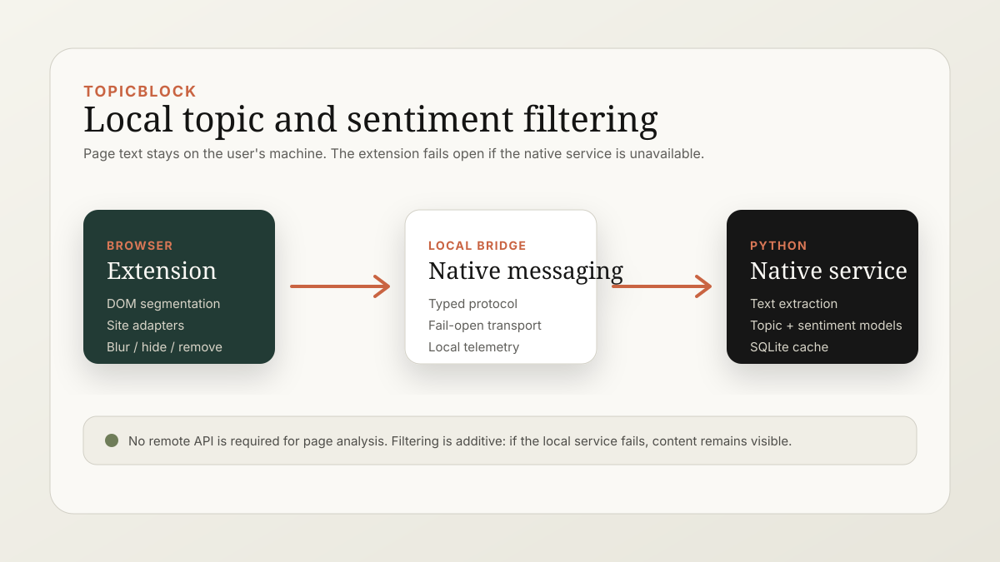

# TopicBlock

TopicBlock is a privacy-first browser extension prototype for filtering web content by topic and sentiment. The extension handles the browser-facing work in TypeScript, while a local Python native service runs text extraction, topic matching, sentiment scoring, caching, and inference orchestration.

The goal is not to block ads or replace platform moderation. The goal is user-controlled filtering where page text stays on the user's machine.



## Prototype Status

TopicBlock is an active prototype. The architecture, protocol, site adapters, filter actions, native pipeline, cache, and model registry are implemented, but this is not packaged as a one-click consumer extension yet.

Current validation status:

- Extension typecheck: expected to pass with `npm run type-check`.
- Extension tests: expected to pass with `npm run test`.
- Extension build: expected to pass with `npm run build`.
- Native tests: expected to pass with `pip install -e ".[dev]"` and `pytest`.
- Full ML inference requires optional ML dependencies and local model downloads.

## What It Does

- Segments pages into content units on supported sites.
- Sends extracted text to a local Python service through Chrome Native Messaging.
- Runs local topic and sentiment analysis.
- Applies user-selected actions such as blur, hide, or remove.
- Fails open: if the native service is unavailable, the page renders normally.

## What To Inspect First

1. `extension/src/content/` - DOM segmentation, site adapters, and filter actions.
2. `extension/src/background/nativeClient.ts` - browser-to-native communication.
3. `extension/src/shared/protocols.ts` - shared wire contract.
4. `native/topicblock_native/pipeline.py` - native orchestration.
5. `native/topicblock_native/models/` - topic and sentiment model implementations.
6. `native/tests/` and `extension/src/**/*.test.ts` - current test coverage.

## Architecture

TopicBlock uses a thin-client / fat-native design:

| Layer | Responsibility |
| --- | --- |
| Browser extension | UI, preferences, page segmentation, site adapters, and filter actions |
| Native messaging client | Transport between the extension and local Python service |
| Python native service | Text extraction, model registry, topic scoring, sentiment scoring, cache, and telemetry |
| Local models | MiniLM or BGE topic embeddings; VADER or DistilBERT sentiment scoring |

The extension currently includes adapters for Reddit, old Reddit, Hacker News, and YouTube-style content surfaces.

## Repository Structure

```text
extension/             TypeScript Manifest V3 browser extension
  src/background/      Service worker and native client
  src/content/         DOM segmentation, site adapters, and filter actions
  src/shared/          Protocols and wire schema
  src/storage/         Preferences and blocked item storage
  src/ui/              Popup, options, and dashboard UI
native/                Python native inference service
  topicblock_native/   Extraction, models, pipeline, cache, server, telemetry
  tests/               Native unit tests
scripts/               Protocol/schema generation
docs/                  Architecture and project visuals
```

## Setup

### Extension

```bash
cd extension
npm install
npm run type-check
npm run test
npm run build
```

Load `extension/dist` as an unpacked browser extension during local development.

### Native Service

```bash
cd native
python3.11 -m venv .venv
source .venv/bin/activate
pip install -e ".[dev]"
pytest
```

Optional ML runtime:

```bash
pip install -e ".[ml]"
```

The ML extra installs heavier dependencies for local model inference. The dev test suite uses mocks where possible so contributors can validate the service without downloading every model.

## Design Principles

- Privacy first: content analysis runs locally.
- User control: filtering is configured by the user, not by a remote service.
- Fail open: broken native inference should not break browsing.
- Protocol first: TypeScript and Python communicate through an explicit wire contract.
- Prototype honesty: this repo shows the working architecture and tests, not a polished extension-store release.

## Limitations

- The project is not packaged for public browser-store installation yet.
- Full ML inference may download sizeable models and requires local compute.
- Site adapters are intentionally limited; new sites need adapter work.
- Filtering quality depends on model choice, thresholds, and extracted text quality.
- Native messaging installation manifests are environment-specific and may need local setup.

## Authors

TopicBlock is a joint project by Amit Kumar Gupta and Joshua Joenathan Thomas.
